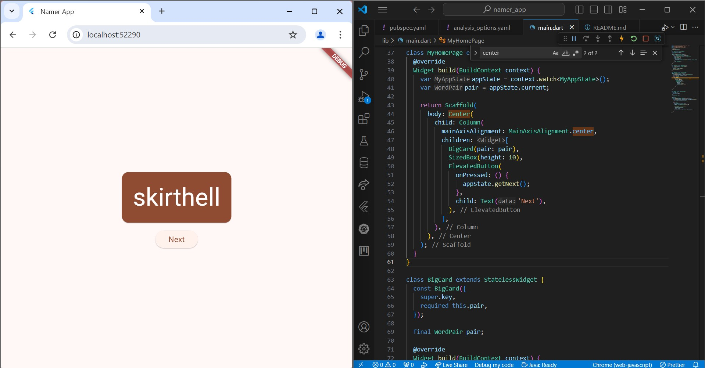

# namer_app

A new Flutter project.

---

Nama: Tyase Nisa'an Jamilaa

Kelas: 3H

Absen: 26

## Getting Started

## **Create your first Flutter project**

**pubspec.yaml**

**analysis_options.yaml**

**lib/main.dart**

## **Add a button**

**Launch the app**

**Adding A Button**

## **Make the App Prettier**

**Extract a widget**

**Add a Card**

**Theme and style**

blue:

green:

**TextTheme**

**Improve accessibility**

center:

remove text and add sizedbox to 10:

## **Add functionality**

**Add the business logic**

**Add the button**

## **Add navigation rail**

